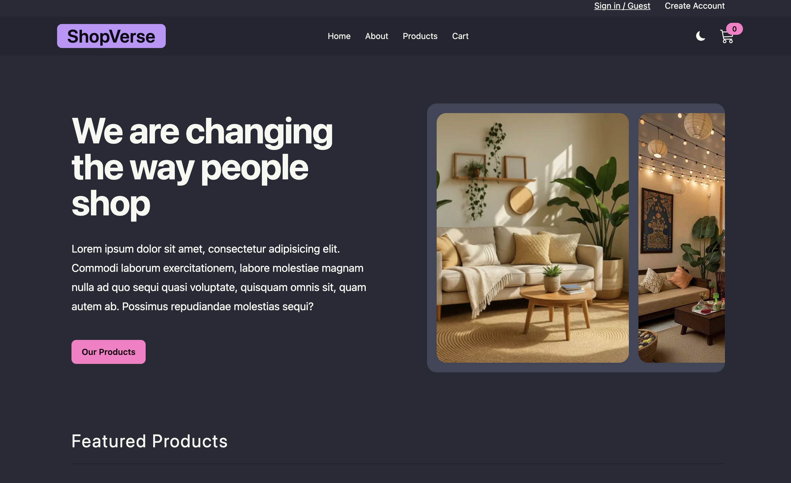

# 🛍️ ShopVerse

Comfy Store is a modern e-commerce web application built with React. Users can browse products, filter and search items, add products to the shopping cart, register and log in, complete the checkout process, and view their order history.

## ✨ Features

- 🔐 User Authentication (Register & Login)
- 🛒 Shopping Cart Management
- 💳 Checkout & Order Placement
- 📦 View Order History
- 🔍 Search Products
- 🏷️ Filter by Category, Company, Price, and Shipping
- ↕️ Sort Products (A-Z, Z-A, Price, etc.)
- 📄 Product Details Page
- 🌙 Dark / Light Theme
- 🎨 Responsive UI with Tailwind CSS & DaisyUI
- ⚡ Fast Data Fetching with React Query
- 🔄 Client-side Routing with React Router
- 📢 Toast Notifications

## 🛠️ Tech Stack

- React
- React Router DOM
- React Query (TanStack Query)
- Redux Toolkit
- Axios
- Tailwind CSS
- DaisyUI
- React Toastify
- Vite

## 📸 Screenshots
### 🏠 Home Page


### 🛍️ Products Page


### 💳 Checkout


## 📁 Project Structure
```
src/
├── components/
├── features/
│   ├── cart/
│   └── user/
├── pages/
├── utils/
├── assets/
├── App.jsx
└── main.jsx
```

## 🚀 Getting Started

### 1. Clone the repository

```bash
git clone https://github.com/myatkayzinthant-123/comfy-store.git
```

### 2. Navigate to the project

```bash
cd comfy-store
```

### 3. Install dependencies

```bash
npm install
```

### 4. Start the development server

```bash
npm run dev
```

The application will run at:

```
http://localhost:5173
```

## 📦 Build for Production

```bash
npm run build
```


## 📸 Screenshots

Add screenshots of your application here.

Example:

- Home Page
- Products Page
- Product Details
- Shopping Cart
- Checkout
- Orders

## 📚 What I Learned

During this project, I practiced:

- Building a complete React application
- React Router Loaders & Actions
- State management with Redux Toolkit
- Server state management with React Query
- API integration using Axios
- Authentication and protected routes
- Shopping cart functionality
- Checkout and order management
- Responsive UI design with Tailwind CSS
- Clean project structure and reusable components

## 🔮 Future Improvements

- ❤️ Wishlist functionality
- ⭐ Product Reviews and ratings
- 💳 Stripe Payment Integration
- 👤 User Profile
- 📊 Admin Dashboard
- 📈 Sales Analytics
- 🔎 Advanced Product Filters

## 👨‍💻 Author

Myatkayzinthant

GitHub: https://github.com/myatkayzinthant-123


## ⭐ Show your support

If you like this project, consider giving it a ⭐ on GitHub.

